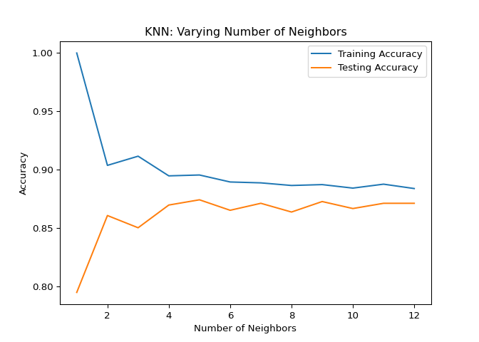

## Classification

In this chapter, you’ll be introduced to classification problems and
learn how to solve them using supervised learning techniques. You’ll
learn how to split data into training and test sets, fit a model, make
predictions, and evaluate accuracy. You’ll discover the relationship
between model complexity and performance, applying what you learn to a
churn dataset, where you will classify the churn status of a telecom
company’s customers.

### Machine learning with scikit-learn

#### Binary classification

<p>
In the video, you saw that there are two types of supervised learning —
classification and regression. Recall that binary classification is used
to predict a target variable that has only two labels, typically
represented numerically with a zero or a one.
</p>
<p>
A dataset, <code>churn_df</code>, has been preloaded for you in the
console.
</p>
<p>
Your task is to examine the data and choose which column could be the
target variable for binary classification.
</p>

``` python
# edited/added
import pandas as pd
churn_df = pd.read_csv("archive/Supervised-Learning-with-scikit-learn/datasets/telecom_churn_clean.csv", index_col=[0])
churn_df.info()
```

    ## <class 'pandas.core.frame.DataFrame'>
    ## Int64Index: 3333 entries, 0 to 3332
    ## Data columns (total 19 columns):
    ##  #   Column                  Non-Null Count  Dtype  
    ## ---  ------                  --------------  -----  
    ##  0   account_length          3333 non-null   int64  
    ##  1   area_code               3333 non-null   int64  
    ##  2   international_plan      3333 non-null   int64  
    ##  3   voice_mail_plan         3333 non-null   int64  
    ##  4   number_vmail_messages   3333 non-null   int64  
    ##  5   total_day_minutes       3333 non-null   float64
    ##  6   total_day_calls         3333 non-null   int64  
    ##  7   total_day_charge        3333 non-null   float64
    ##  8   total_eve_minutes       3333 non-null   float64
    ##  9   total_eve_calls         3333 non-null   int64  
    ##  10  total_eve_charge        3333 non-null   float64
    ##  11  total_night_minutes     3333 non-null   float64
    ##  12  total_night_calls       3333 non-null   int64  
    ##  13  total_night_charge      3333 non-null   float64
    ##  14  total_intl_minutes      3333 non-null   float64
    ##  15  total_intl_calls        3333 non-null   int64  
    ##  16  total_intl_charge       3333 non-null   float64
    ##  17  customer_service_calls  3333 non-null   int64  
    ##  18  churn                   3333 non-null   int64  
    ## dtypes: float64(8), int64(11)
    ## memory usage: 520.8 KB

-   [ ] <code>“customer_service_calls”</code>
-   [ ] <code>“total_night_charge”</code>
-   [x] <code>“churn”</code>
-   [ ] <code>“account_length”</code>

<p class>
Correct! <code>churn</code> has values of <code>0</code> or
<code>1</code>, so it can be predicted using a binary classification
model.
</p>

#### The supervised learning workflow

<p>
Recall that scikit-learn offers a repeatable workflow for using
supervised learning models to predict the target variable values when
presented with new data.
</p>
<p>
Reorder the pseudo-code provided so it accurately represents the
workflow of building a supervised learning model and making predictions.
</p>

<li>
Drag the code blocks into the correct order to represent how a
supervised learning workflow would be executed.
</li>

``` python
from sklearn.module import Model
model = Model()
model.fit(X, y)
model.predict(X_new)
```

<p>
Great work! You can see how scikit-learn enables predictions to be made
in only a few lines of code!
</p>

### The classification challenge

#### k-Nearest Neighbors: Fit

<p>
In this exercise, you will build your first classification model using
the <code>churn_df</code> dataset, which has been preloaded for the
remainder of the chapter.
</p>
<p>
The features to use will be <code>“account_length”</code> and
<code>“customer_service_calls”</code>. The target, <code>“churn”</code>,
needs to be a single column with the same number of observations as the
feature data.
</p>
<p>
You will convert the features and the target variable into NumPy arrays,
create an instance of a KNN classifier, and then fit it to the data.
</p>
<p>
<code>numpy</code> has also been preloaded for you as <code>np</code>.
</p>

<li>
Import <code>KNeighborsClassifier</code> from
<code>sklearn.neighbors</code>.
</li>
<li>
Create an array called <code>X</code> containing values from the
<code>“account_length”</code> and <code>“customer_service_calls”</code>
columns, and an array called <code>y</code> for the values of the
<code>“churn”</code> column.
</li>
<li>
Instantiate a <code>KNeighborsClassifier</code> called <code>knn</code>
with <code>6</code> neighbors.
</li>
<li>
Fit the classifier to the data using the <code>.fit()</code> method.
</li>

``` python
# Import KNeighborsClassifier
from sklearn.neighbors import KNeighborsClassifier 

# Create arrays for the features and the target variable
y = churn_df["churn"].values
X = churn_df[["account_length", "customer_service_calls"]].values

# Create a KNN classifier with 6 neighbors
knn = KNeighborsClassifier(n_neighbors=6)

# Fit the classifier to the data
knn.fit(X, y)
```

    ## KNeighborsClassifier(n_neighbors=6)

<p class>
Excellent! Now that your KNN classifier has been fit to the data, it can
be used to predict the labels of new data points.
</p>

#### k-Nearest Neighbors: Predict

<p>
Now you have fit a KNN classifier, you can use it to predict the label
of new data points. All available data was used for training, however,
fortunately, there are new observations available. These have been
preloaded for you as <code>X_new</code>.
</p>
<p>
The model <code>knn</code>, which you created and fit the data in the
last exercise, has been preloaded for you. You will use your classifier
to predict the labels of a set of new data points:
</p>
<pre><code>X_new = np.array([[30.0, 17.5],
                  [107.0, 24.1],
                  [213.0, 10.9]])
</code></pre>

<li>
Create <code>y_pred</code> by predicting the target values of the unseen
features <code>X_new</code>.
</li>
<li>
Print the predicted labels for the set of predictions.
</li>

``` python
# edited/added
import numpy as np
X_new = np.array([[30.0, 17.5], [107.0, 24.1], [213.0, 10.9]])

# Predict the labels for the X_new
y_pred = knn.predict(X_new)

# Print the predictions for X_new
print("Predictions: {}".format(y_pred)) 
```

    ## Predictions: [0 1 0]

<p class>
Great work! The model has predicted the first and third customers will
not churn in the new array. But how do we know how accurate these
predictions are? Let’s explore how to measure a model’s performance in
the next video.
</p>

### Measuring model performance

#### Train/test split + computing accuracy

<p>
Now that you have learned about the importance of splitting your data
into training and test sets, it’s time to practice doing this on the
<code>churn_df</code> dataset!
</p>
<p>
NumPy arrays have been created for you containing the features as
<code>X</code> and the target variable as <code>y</code>. You will split
them into training and test sets, fit a KNN classifier to the training
data, and then compute its accuracy on the test data using the
<code>.score()</code> method.
</p>

<li>
Import <code>train_test_split</code> from
<code>sklearn.model_selection</code>.
</li>
<li>
Split <code>X</code> and <code>y</code> into training and test sets,
setting <code>test_size</code> equal to 20%, <code>random_state</code>
to <code>42</code>, and ensuring the target label proportions reflect
that of the original dataset.
</li>
<li>
Fit the <code>knn</code> model to the training data.
</li>
<li>
Compute and print the model’s accuracy for the test data.
</li>

``` python
# Import the module
from sklearn.model_selection import train_test_split

X = churn_df.drop("churn", axis=1).values
y = churn_df["churn"].values

# Split into training and test sets
X_train, X_test, y_train, y_test = train_test_split(X, y, test_size=0.2, random_state=42, stratify=y)
knn = KNeighborsClassifier(n_neighbors=5)

# Fit the classifier to the training data
knn.fit(X_train, y_train)

# Print the accuracy
```

    ## KNeighborsClassifier()

``` python
print(knn.score(X_test, y_test))
```

    ## 0.8740629685157422

<p class>
Excellent! In a few lines of code you split a dataset, fit a KNN model,
and found its accuracy to be 87%!
</p>

#### Overfitting and underfitting

<p>
Interpreting model complexity is a great way to evaluate performance
when utilizing supervised learning. Your aim is to produce a model that
can interpret the relationship between features and the target variable,
as well as generalize well when exposed to new observations.
</p>
<p>
You will generate accuracy scores for the training and test sets using a
KNN classifier with different <code>n_neighbor</code> values, which you
will plot in the next exercise.
</p>
<p>
The training and test sets have been created from the
<code>churn_df</code> dataset and preloaded as <code>X_train</code>,
<code>X_test</code>, <code>y_train</code>, and <code>y_test</code>.
</p>
<p>
In addition, <code>KNeighborsClassifier</code> has been imported for you
along with <code>numpy</code> as <code>np</code>.
</p>

<li>
Create <code>neighbors</code> as a <code>numpy</code> array of values
from <code>1</code> up to and including <code>12</code>.
</li>
<li>
Instantiate a KNN classifier, with the number of neighbors equal to the
<code>neighbor</code> iterator.
</li>
<li>
Fit the model to the training data.
</li>
<li>
Calculate accuracy scores for the training set and test set separately
using the <code>.score()</code> method, and assign the results to the
index of the <code>train_accuracies</code> and
<code>test_accuracies</code> dictionaries, respectively.
</li>

``` python
# Create neighbors
neighbors = np.arange(1, 13)
train_accuracies = {}
test_accuracies = {}

for neighbor in neighbors:
  
    # Set up a KNN Classifier
    knn = KNeighborsClassifier(n_neighbors=neighbor)
  
    # Fit the model
    knn.fit(X_train, y_train)
  
    # Compute accuracy
    train_accuracies[neighbor] = knn.score(X_train, y_train)
    test_accuracies[neighbor] = knn.score(X_test, y_test)
```

    ## KNeighborsClassifier(n_neighbors=1)
    ## KNeighborsClassifier(n_neighbors=2)
    ## KNeighborsClassifier(n_neighbors=3)
    ## KNeighborsClassifier(n_neighbors=4)
    ## KNeighborsClassifier()
    ## KNeighborsClassifier(n_neighbors=6)
    ## KNeighborsClassifier(n_neighbors=7)
    ## KNeighborsClassifier(n_neighbors=8)
    ## KNeighborsClassifier(n_neighbors=9)
    ## KNeighborsClassifier(n_neighbors=10)
    ## KNeighborsClassifier(n_neighbors=11)
    ## KNeighborsClassifier(n_neighbors=12)

``` python
print(neighbors, '\n', train_accuracies, '\n', test_accuracies)
```

    ## [ 1  2  3  4  5  6  7  8  9 10 11 12] 
    ##  {1: 1.0, 2: 0.9036009002250562, 3: 0.9114778694673669, 4: 0.8945986496624156, 5: 0.8953488372093024, 6: 0.8893473368342085, 7: 0.8885971492873218, 8: 0.8863465866466617, 9: 0.8870967741935484, 10: 0.8840960240060015, 11: 0.8874718679669917, 12: 0.8837209302325582} 
    ##  {1: 0.7946026986506747, 2: 0.8605697151424287, 3: 0.8500749625187406, 4: 0.8695652173913043, 5: 0.8740629685157422, 6: 0.8650674662668666, 7: 0.8710644677661169, 8: 0.863568215892054, 9: 0.8725637181409296, 10: 0.8665667166416792, 11: 0.8710644677661169, 12: 0.8710644677661169}

<p class>
Notice how training accuracy decreases as the number of neighbors
initially gets larger, and vice versa for the testing accuracy? These
scores would be much easier to interpret in a line plot, so let’s
produce a model complexity curve of these results.
</p>

#### Visualizing model complexity

<p>
Now you have calculated the accuracy of the KNN model on the training
and test sets using various values of <code>n_neighbors</code>, you can
create a model complexity curve to visualize how performance changes as
the model becomes less complex!
</p>
<p>
The variables <code>neighbors</code>, <code>train_accuracies</code>, and
<code>test_accuracies</code>, which you generated in the previous
exercise, have all been preloaded for you. You will plot the results to
aid in finding the optimal number of neighbors for your model.
</p>

<li>
Add a title <code>“KNN: Varying Number of Neighbors”</code>.
</li>
<li>
Plot the <code>.values()</code> method of <code>train_accuracies</code>
on the y-axis against <code>neighbors</code> on the x-axis, with a label
of <code>“Training Accuracy”</code>.
</li>
<li>
Plot the <code>.values()</code> method of <code>test_accuracies</code>
on the y-axis against <code>neighbors</code> on the x-axis, with a label
of <code>“Testing Accuracy”</code>.
</li>
<li>
Display the plot.
</li>

``` python
# edited/added
import matplotlib.pyplot as plt

# Add a title
plt.title("KNN: Varying Number of Neighbors")

# Plot training accuracies
plt.plot(neighbors, list(train_accuracies.values()), label="Training Accuracy") # edited/added

# Plot test accuracies
plt.plot(neighbors, list(test_accuracies.values()), label="Testing Accuracy") # edited/added

plt.legend()
plt.xlabel("Number of Neighbors")
plt.ylabel("Accuracy")

# Display the plot
plt.show()
```



<p class>
Great work! See how training accuracy decreases and test accuracy
increases as the number of neighbors gets larger. For the test set,
accuracy peaks with 7 neighbors, suggesting it is the optimal value for
our model. Now let’s explore regression models!
</p>