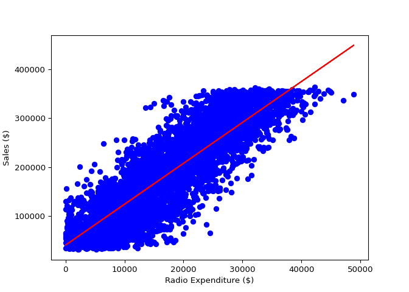
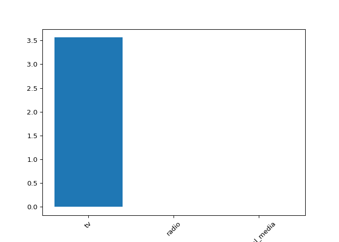

## Regression

In this chapter, you will be introduced to regression, and build models
to predict sales values using a dataset on advertising expenditure. You
will learn about the mechanics of linear regression and common
performance metrics such as R-squared and root mean squared error. You
will perform k-fold cross-validation, and apply regularization to
regression models to reduce the risk of overfitting.

### Introduction to regression

#### Creating features

<p>
In this chapter, you will work with a dataset called
<code>sales_df</code>, which contains information on advertising
campaign expenditure across different media types, and the number of
dollars generated in sales for the respective campaign. The dataset has
been preloaded for you. Here are the first two rows:
</p>
<pre><code>     tv        radio      social_media    sales
1    13000.0   9237.76    2409.57         46677.90
2    41000.0   15886.45   2913.41         150177.83
</code></pre>
<p>
You will use the advertising expenditure as features to predict sales
values, initially working with the <code>“radio”</code> column. However,
before you make any predictions you will need to create the feature and
target arrays, reshaping them to the correct format for scikit-learn.
</p>

<li>
Create <code>X</code>, an array of the values from the
<code>sales_df</code> DataFrame’s <code>“radio”</code> column.
</li>
<li>
Create <code>y</code>, an array of the values from the
<code>sales_df</code> DataFrame’s <code>“sales”</code> column.
</li>
<li>
Reshape <code>X</code> into a two-dimensional NumPy array.
</li>
<li>
Print the shape of <code>X</code> and <code>y</code>.
</li>

``` python
# edited/added
sales_df = pd.read_csv("archive/Supervised-Learning-with-scikit-learn/datasets/advertising_and_sales_clean.csv").drop(['influencer'], axis = 1)

import numpy as np

# Create X from the radio column's values
X = sales_df["radio"].values

# Create y from the sales column's values
y = sales_df["sales"].values

# Reshape X
X = X.reshape(-1, 1)

# Check the shape of the features and targets
print(X.shape, y.shape)
```

    ## (4546, 1) (4546,)

<p class>
Excellent! See that there are 4546 values in both arrays? Now let’s
build a linear regression model!
</p>

#### Building a linear regression model

<p>
Now you have created your feature and target arrays, you will train a
linear regression model on all feature and target values.
</p>
<p>
As the goal is to assess the relationship between the feature and target
values there is no need to split the data into training and test sets.
</p>
<p>
<code>X</code> and <code>y</code> have been preloaded for you as
follows:
</p>
<pre><code>y = sales_df["sales"].values
X = sales_df["radio"].values.reshape(-1, 1)
</code></pre>

<li>
Import <code>LinearRegression</code>.
</li>
<li>
Instantiate a linear regression model.
</li>
<li>
Predict sales values using <code>X</code>, storing as
<code>predictions</code>.
</li>

``` python
# Import LinearRegression
from sklearn.linear_model import LinearRegression

# Create the model
reg = LinearRegression()

# Fit the model to the data
reg.fit(X, y)

# Make predictions
```

    ## LinearRegression()

``` python
predictions = reg.predict(X)

print(predictions[:5])
```

    ## [ 95491.17119147 117829.51038393 173423.38071499 291603.11444202
    ##  111137.28167129]

<p class>
Great model building! See how sales values for the first five
predictions range from $95,000 to over $290,000. Let’s visualize the
model’s fit.
</p>

#### Visualizing a linear regression model

<p>
Now you have built your linear regression model and trained it using all
available observations, you can visualize how well the model fits the
data. This allows you to interpret the relationship between
<code>radio</code> advertising expenditure and <code>sales</code>
values.
</p>
<p>
The variables <code>X</code>, an array of <code>radio</code> values,
<code>y</code>, an array of <code>sales</code> values, and
<code>predictions</code>, an array of the model’s predicted values for
<code>y</code> given <code>X</code>, have all been preloaded for you
from the previous exercise.
</p>

<li>
Import <code>matplotlib.pyplot</code> as <code>plt</code>.
</li>
<li>
Create a scatter plot visualizing <code>y</code> against <code>X</code>,
with observations in blue.
</li>
<li>
Draw a red line plot displaying the predictions against <code>X</code>.
</li>
<li>
Display the plot.
</li>

``` python
# Import matplotlib.pyplot
import matplotlib.pyplot as plt

# Create scatter plot
plt.scatter(X, y, color="blue")

# Create line plot
plt.plot(X, predictions, color="red")
plt.xlabel("Radio Expenditure ($)")
plt.ylabel("Sales ($)")

# Display the plot
plt.show()
```



<p class>
The model nicely captures a near-perfect linear correlation between
radio advertising expenditure and sales! Now let’s take a look at what
is going on under the hood to calculate this relationship.
</p>

### The basics of linear regression

#### Fit and predict for regression

<p>
Now you have seen how linear regression works, your task is to create a
multiple linear regression model using all of the features in the
<code>sales_df</code> dataset, which has been preloaded for you. As a
reminder, here are the first two rows:
</p>
<pre><code>     tv        radio      social_media    sales
1    13000.0   9237.76    2409.57         46677.90
2    41000.0   15886.45   2913.41         150177.83
</code></pre>
<p>
You will then use this model to predict sales based on the values of the
test features.
</p>
<p>
<code>LinearRegression</code> and <code>train_test_split</code> have
been preloaded for you from their respective modules.
</p>

<li>
Create <code>X</code>, an array containing values of all features in
<code>sales_df</code>, and <code>y</code>, containing all values from
the <code>“sales”</code> column.
</li>
<li>
Instantiate a linear regression model.
</li>
<li>
Fit the model to the training data.
</li>
<li>
Create <code>y_pred</code>, making predictions for <code>sales</code>
using the test features.
</li>

``` python
# Create X and y arrays
X = sales_df.drop("sales", axis=1).values
y = sales_df["sales"].values

X_train, X_test, y_train, y_test = train_test_split(X, y, test_size=0.3, random_state=42)

# Instantiate the model
reg = LinearRegression()

# Fit the model to the data
reg.fit(X_train, y_train)

# Make predictions
```

    ## LinearRegression()

``` python
y_pred = reg.predict(X_test)
print("Predictions: {}, Actual Values: {}".format(y_pred[:2], y_test[:2]))
```

    ## Predictions: [53176.66154234 70996.19873235], Actual Values: [55261.28 67574.9 ]

<p class>
Great work! The first two predictions appear to be within around 5% of
the actual values from the test set!
</p>

#### Regression performance

<p>
Now you have fit a model, <code>reg</code>, using all features from
<code>sales_df</code>, and made predictions of sales values, you can
evaluate performance using some common regression metrics.
</p>
<p>
The variables <code>X_train</code>, <code>X_test</code>,
<code>y_train</code>, <code>y_test</code>, and <code>y_pred</code>,
along with the fitted model, <code>reg</code>, all from the last
exercise, have been preloaded for you.
</p>
<p>
Your task is to find out how well the features can explain the variance
in the target values, along with assessing the model’s ability to make
predictions on unseen data.
</p>

<li>
Import <code>mean_squared_error</code>.
</li>
<li>
Calculate the model’s R-squared score by passing the test feature values
and the test target values to an appropriate method.
</li>
<li>
Calculate the model’s root mean squared error using <code>y_test</code>
and <code>y_pred</code>.
</li>
<li>
Print <code>r_squared</code> and <code>rmse</code>.
</li>

``` python
# Import mean_squared_error
from sklearn.metrics import mean_squared_error

# Compute R-squared
r_squared = reg.score(X_test, y_test)

# Compute RMSE
rmse = mean_squared_error(y_test, y_pred, squared=False)

# Print the metrics
print("R^2: {}".format(r_squared))
```

    ## R^2: 0.9990152104759368

``` python
print("RMSE: {}".format(rmse))
```

    ## RMSE: 2944.4331996001

<p class>
Wow, the features explain 99.9% of the variance in sales values! Looks
like this company’s advertising strategy is working well!
</p>

### Cross-validation

#### Cross-validation for R-squared

<p>
Cross-validation is a vital approach to evaluating a model. It maximizes
the amount of data that is available to the model, as the model is not
only trained but also tested on all of the available data.
</p>
<p>
In this exercise, you will build a linear regression model, then use
6-fold cross-validation to assess its accuracy for predicting sales
using social media advertising expenditure. You will display the
individual score for each of the six-folds.
</p>
<p>
The <code>sales_df</code> dataset has been split into <code>y</code> for
the target variable, and <code>X</code> for the features, and preloaded
for you. <code>LinearRegression</code> has been imported from
<code>sklearn.linear_model</code>.
</p>

<li>
Import <code>KFold</code> and <code>cross_val_score</code>.
</li>
<li>
Create <code>kf</code> by calling <code>KFold()</code>, setting the
number of splits to six, <code>shuffle</code> to <code>True</code>, and
setting a seed of <code>5</code>.
</li>
<li>
Perform cross-validation using <code>reg</code> on <code>X</code> and
<code>y</code>, passing <code>kf</code> to <code>cv</code>.
</li>
<li>
Print the <code>cv_scores</code>.
</li>

``` python
# Import the necessary modules
from sklearn.model_selection import KFold, cross_val_score

# Create a KFold object
kf = KFold(n_splits=6, shuffle=True, random_state=5)

reg = LinearRegression()

# Compute 6-fold cross-validation scores
cv_scores = cross_val_score(reg, X, y, cv=kf)

# Print scores
print(cv_scores)
```

    ## [0.99894062 0.99909245 0.9990103  0.99896344 0.99889153 0.99903953]

<p class>
Notice how R-squared for each fold ranged between <code>0.74</code> and
<code>0.77</code>? By using cross-validation, we can see how performance
varies depending on how the data is split!
</p>

#### Analyzing cross-validation metrics

<p>
Now you have performed cross-validation, it’s time to analyze the
results.
</p>
<p>
You will display the mean, standard deviation, and 95% confidence
interval for <code>cv_results</code>, which has been preloaded for you
from the previous exercise.
</p>
<p>
<code>numpy</code> has been imported for you as <code>np</code>.
</p>

<li>
Calculate and print the mean of the results.
</li>
<li>
Calculate and print the standard deviation of <code>cv_results</code>.
</li>
<li>
Display the 95% confidence interval for your results using
<code>np.quantile()</code>.
</li>

``` python
# edited/added
cv_results = cv_scores

# Print the mean
print(np.mean(cv_results))

# Print the standard deviation
```

    ## 0.9989896443678249

``` python
print(np.std(cv_results))

# Print the 95% confidence interval
```

    ## 6.608118371529651e-05

``` python
print(np.quantile(cv_results, [0.025, 0.975]))
```

    ## [0.99889767 0.99908583]

<p class>
An average score of <code>0.75</code> with a low standard deviation is
pretty good for a model out of the box! Now let’s learn how to apply
regularization to our regression models.
</p>

### Regularized regression

#### Regularized regression: Ridge

<p>
Ridge regression performs regularization by computing the
<em>squared</em> values of the model parameters multiplied by alpha and
adding them to the loss function.
</p>
<p>
In this exercise, you will fit ridge regression models over a range of
different alpha values, and print their $\\(R^2\\)$ scores. You will use
all of the features in the <code>sales_df</code> dataset to predict
<code>“sales”</code>. The data has been split into <code>X_train</code>,
<code>X_test</code>, <code>y_train</code>, <code>y_test</code> for you.
</p>
<p>
A variable called <code>alphas</code> has been provided as a list
containing different alpha values, which you will loop through to
generate scores.
</p>

<li>
Import <code>Ridge</code>.
</li>
<li>
Instantiate <code>Ridge</code>, setting alpha equal to
<code>alpha</code>.
</li>
<li>
Fit the model to the training data.
</li>
<li>
Calculate the (*R*<sup>2</sup>) score for each iteration of
<code>ridge</code>.
</li>

``` python
# Import Ridge
from sklearn.linear_model import Ridge
alphas = [0.1, 1.0, 10.0, 100.0, 1000.0, 10000.0]
ridge_scores = []

for alpha in alphas:
  
  # Create a Ridge regression model
  ridge = Ridge(alpha=alpha)
  
  # Fit the data
  ridge.fit(X_train, y_train)
  
  # Obtain R-squared
  score = ridge.score(X_test, y_test)
  ridge_scores.append(score)
```

    ## Ridge(alpha=0.1)
    ## Ridge()
    ## Ridge(alpha=10.0)
    ## Ridge(alpha=100.0)
    ## Ridge(alpha=1000.0)
    ## Ridge(alpha=10000.0)

``` python
print(ridge_scores)
```

    ## [0.9990152104759369, 0.9990152104759373, 0.9990152104759419, 0.999015210475987, 0.9990152104764387, 0.9990152104809561]

<p class>
Well done! The scores don’t appear to change much as <code>alpha</code>
increases, which is indicative of how well the features explain the
variance in the target—even by heavily penalizing large coefficients,
underfitting does not occur!
</p>

#### Lasso regression for feature importance

<p>
In the video, you saw how lasso regression can be used to identify
important features in a dataset.
</p>
<p>
In this exercise, you will fit a lasso regression model to the
<code>sales_df</code> data and plot the model’s coefficients.
</p>
<p>
The feature and target variable arrays have been pre-loaded as
<code>X</code> and <code>y</code>, along with
<code>sales_columns</code>, which contains the dataset’s feature names.
</p>

<li>
Import <code>Lasso</code> from <code>sklearn.linear_model</code>.
</li>
<li>
Instantiate a Lasso regressor with an alpha of <code>0.3</code>.
</li>
<li>
Fit the model to the data.
</li>
<li>
Compute the model’s coefficients, storing as <code>lasso_coef</code>.
</li>

``` python
# edited/added
sales_columns = sales_df.drop(['sales'], axis = 1).columns

# Import Lasso
from sklearn.linear_model import Lasso

# Instantiate a lasso regression model
lasso = Lasso(alpha=0.3)

# Fit the model to the data
lasso.fit(X, y)

# Compute and print the coefficients
```

    ## Lasso(alpha=0.3)

``` python
lasso_coef = lasso.coef_
print(lasso_coef)
```

    ## [ 3.56256962 -0.00397035  0.00496385]

``` python
plt.bar(sales_columns, lasso_coef)
```

    ## <BarContainer object of 3 artists>

``` python
plt.xticks(rotation=45)
```

    ## ([0, 1, 2], [Text(0, 0, ''), Text(0, 0, ''), Text(0, 0, '')])

``` python
plt.show()
```



<p class>
See how the figure makes it clear that expenditure on TV advertising is
the most important feature in the dataset to predict sales values! In
the next chapter, we will learn how to further assess and improve our
model’s performance!
</p>