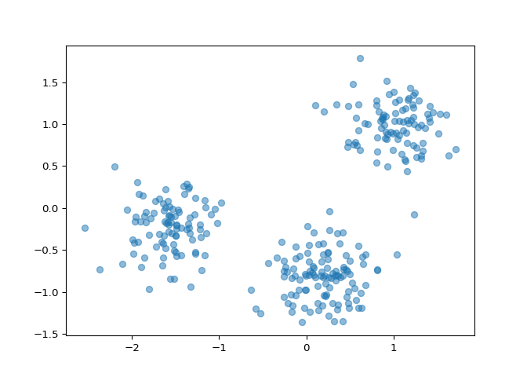
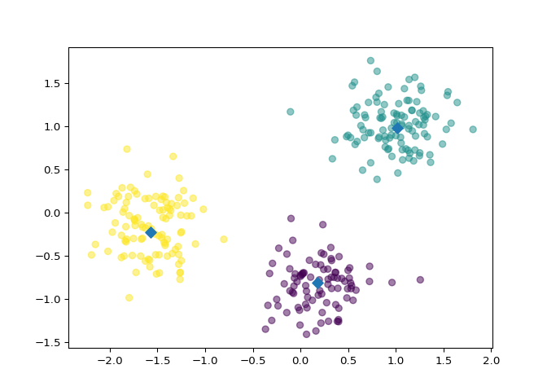
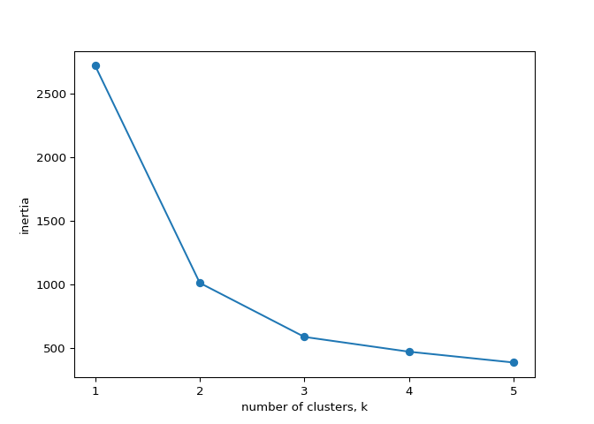

## Clustering for dataset exploration

<p class="chapter__description">
Learn how to discover the underlying groups (or “clusters”) in a
dataset. By the end of this chapter, you’ll be clustering companies
using their stock market prices, and distinguishing different species by
clustering their measurements.
</p>

### Unsupervised Learning

#### How many clusters?

<p>
You are given an array <code>points</code> of size 300x2, where each row
gives the (x, y) co-ordinates of a point on a map. Make a scatter plot
of these points, and use the scatter plot to guess how many clusters
there are.
</p>
<p>
<code>matplotlib.pyplot</code> has already been imported as
<code>plt</code>. In the IPython Shell:
</p>
<li>
Create an array called <code>xs</code> that contains the values of
<code>points\[:,0\]</code> - that is, column <code>0</code> of
<code>points</code>.
</li>
<li>
Create an array called <code>ys</code> that contains the values of
<code>points\[:,1\]</code> - that is, column <code>1</code> of
<code>points</code>.
</li>
<li>
Make a scatter plot by passing <code>xs</code> and <code>ys</code> to
the <code>plt.scatter()</code> function.
</li>
<li>
Call the <code>plt.show()</code> function to show your plot.
</li>
<p>
How many clusters do you see?
</p>

``` python
# edited/added
import numpy as np
import pandas as pd
import matplotlib.pyplot as plt
points = np.array(pd.read_csv("archive/Unsupervised-Learning-in-Python/datasets/points.csv", header = None))
xs = points[:,0]
ys = points[:,1]
plt.scatter(xs, ys, alpha=0.5)
plt.show()
```



-   [ ] 2
-   [x] 3
-   [ ] 300

<p class>
Correct! The scatter plot suggests that there are 3 distinct clusters.
</p>

#### Clustering 2D points

<p>
From the scatter plot of the previous exercise, you saw that the points
seem to separate into 3 clusters. You’ll now create a KMeans model to
find 3 clusters, and fit it to the data points from the previous
exercise. After the model has been fit, you’ll obtain the cluster labels
for some new points using the <code>.predict()</code> method.
</p>
<p>
You are given the array <code>points</code> from the previous exercise,
and also an array <code>new_points</code>.
</p>

<li>
Import <code>KMeans</code> from <code>sklearn.cluster</code>.
</li>
<li>
Using <code>KMeans()</code>, create a <code>KMeans</code> instance
called <code>model</code> to find <code>3</code> clusters. To specify
the number of clusters, use the <code>n_clusters</code> keyword
argument.
</li>
<li>
Use the <code>.fit()</code> method of <code>model</code> to fit the
model to the array of points <code>points</code>.
</li>
<li>
Use the <code>.predict()</code> method of <code>model</code> to predict
the cluster labels of <code>new_points</code>, assigning the result to
<code>labels</code>.
</li>
<li>
Hit submit to see the cluster labels of <code>new_points</code>.
</li>

``` python
# edited/added
import numpy as np
import pandas as pd
points = np.array(pd.read_csv("archive/Unsupervised-Learning-in-Python/datasets/points.csv", header = None))
new_points = np.array(pd.read_csv("archive/Unsupervised-Learning-in-Python/datasets/new_points.csv", header = None))

# Import KMeans
from sklearn.cluster import KMeans

# Create a KMeans instance with 3 clusters: model
model = KMeans(n_clusters=3)

# Fit model to points
model.fit(points)

# Determine the cluster labels of new_points: labels
```

    ## KMeans(n_clusters=3)

``` python
labels = model.predict(new_points)

# Print cluster labels of new_points
print(labels)
```

    ## [0 1 2 0 1 0 1 1 1 2 0 1 1 2 2 1 2 2 1 1 2 1 0 1 0 2 1 2 2 0 0 1 1 1 2 0 1
    ##  1 0 1 2 0 0 2 0 1 2 2 1 1 1 1 2 2 0 0 2 2 2 0 0 1 1 1 0 1 2 1 0 2 0 0 0 1
    ##  0 2 2 0 1 2 0 2 0 1 2 1 2 0 1 1 1 0 1 1 0 2 2 2 2 0 1 0 2 2 0 0 1 0 2 2 0
    ##  2 2 2 1 1 1 1 2 2 1 0 1 2 1 0 2 1 2 2 1 2 1 2 0 1 0 0 1 2 0 1 0 0 2 1 1 0
    ##  2 0 2 1 0 2 2 0 2 1 1 2 1 2 2 1 1 0 1 1 2 0 2 0 0 1 0 1 1 0 0 2 0 0 0 2 1
    ##  1 0 2 0 2 2 1 1 1 0 1 1 1 2 2 0 1 0 0 0 2 1 1 1 1 1 1 2 2 1 2 2 2 2 1 2 2
    ##  1 1 0 2 0 0 2 0 2 0 2 1 1 2 1 1 1 2 0 0 2 1 1 2 1 2 2 1 2 2 0 2 0 0 0 1 2
    ##  2 2 0 1 0 2 0 2 2 1 0 0 0 2 1 1 1 0 1 2 2 1 0 0 2 0 0 2 0 1 0 2 2 2 2 1 2
    ##  2 1 1 0]

<p class>
Great work! You’ve successfully performed k-Means clustering and
predicted the labels of new points. But it is not easy to inspect the
clustering by just looking at the printed labels. A visualization would
be far more useful. In the next exercise, you’ll inspect your clustering
with a scatter plot!
</p>

#### Inspect your clustering

<p>
Let’s now inspect the clustering you performed in the previous exercise!
</p>
<p>
A solution to the previous exercise has already run, so
<code>new_points</code> is an array of points and <code>labels</code> is
the array of their cluster labels.
</p>

<li>
Import <code>matplotlib.pyplot</code> as <code>plt</code>.
</li>
<li>
Assign column <code>0</code> of <code>new_points</code> to
<code>xs</code>, and column <code>1</code> of <code>new_points</code> to
<code>ys</code>.
</li>
<li>
Make a scatter plot of <code>xs</code> and <code>ys</code>, specifying
the <code>c=labels</code> keyword arguments to color the points by their
cluster label. Also specify <code>alpha=0.5</code>.
</li>
<li>
Compute the coordinates of the centroids using the
<code>.cluster_centers\_</code> attribute of <code>model</code>.
</li>
<li>
Assign column <code>0</code> of <code>centroids</code> to
<code>centroids_x</code>, and column <code>1</code> of
<code>centroids</code> to <code>centroids_y</code>.
</li>
<li>
Make a scatter plot of <code>centroids_x</code> and
<code>centroids_y</code>, using <code>‘D’</code> (a diamond) as a marker
by specifying the <code>marker</code> parameter. Set the size of the
markers to be <code>50</code> using <code>s=50</code>.
</li>

``` python
# Import pyplot
from matplotlib import pyplot as plt

# Assign the columns of new_points: xs and ys
xs = new_points[:,0]
ys = new_points[:,1]

# Make a scatter plot of xs and ys, using labels to define the colors
plt.scatter(xs, ys, c=labels, alpha=0.5)

# Assign the cluster centers: centroids
centroids = model.cluster_centers_

# Assign the columns of centroids: centroids_x, centroids_y
centroids_x = centroids[:,0]
centroids_y = centroids[:,1]

# Make a scatter plot of centroids_x and centroids_y
plt.scatter(centroids_x, centroids_y, marker='D', s=50)
plt.show()
```



<p class>
Fantastic! The clustering looks great! But how can you be sure that 3
clusters is the correct choice? In other words, how can you evaluate the
quality of a clustering? Tune into the next video in which Ben will
explain how to evaluate a clustering!
</p>

### Evaluating a clustering

#### How many clusters of grain?

<p>
In the video, you learned how to choose a good number of clusters for a
dataset using the k-means inertia graph. You are given an array
<code>samples</code> containing the measurements (such as area,
perimeter, length, and several others) of samples of grain. What’s a
good number of clusters in this case?
</p>
<p>
<code>KMeans</code> and PyPlot (<code>plt</code>) have already been
imported for you.
</p>
<p>
This dataset was sourced from the
<a href="https://archive.ics.uci.edu/ml/datasets/seeds">UCI Machine
Learning Repository</a>.
</p>

<li>
For each of the given values of <code>k</code>, perform the following
steps:
</li>
<li>
Create a <code>KMeans</code> instance called <code>model</code> with
<code>k</code> clusters.
</li>
<li>
Fit the model to the grain data <code>samples</code>.
</li>
<li>
Append the value of the <code>inertia\_</code> attribute of
<code>model</code> to the list <code>inertias</code>.
</li>
<li>
The code to plot <code>ks</code> vs <code>inertias</code> has been
written for you, so hit submit to see the plot!
</li>

``` python
# edited/added
grains = pd.read_csv("archive/Unsupervised-Learning-in-Python/datasets/grains.csv")
samples = np.array(grains)[:,:7]
varieties = list(np.array(grains)[:,8])

ks = range(1, 6)
inertias = []

for k in ks:
    # Create a KMeans instance with k clusters: model
    model = KMeans(n_clusters=k)
    
    # Fit model to samples
    model.fit(samples)
    
    # Append the inertia to the list of inertias
    inertias.append(model.inertia_)
    
# Plot ks vs inertias
```

    ## KMeans(n_clusters=1)
    ## KMeans(n_clusters=2)
    ## KMeans(n_clusters=3)
    ## KMeans(n_clusters=4)
    ## KMeans(n_clusters=5)

``` python
plt.plot(ks, inertias, '-o')
plt.xlabel('number of clusters, k')
plt.ylabel('inertia')
plt.xticks(ks)
```

    ## ([<matplotlib.axis.XTick object at 0x7ffcdace2910>, <matplotlib.axis.XTick object at 0x7ffcdace2a60>, <matplotlib.axis.XTick object at 0x7ffcdace95e0>, <matplotlib.axis.XTick object at 0x7ffcdacf72e0>, <matplotlib.axis.XTick object at 0x7ffcdacf7610>], [Text(0, 0, ''), Text(0, 0, ''), Text(0, 0, ''), Text(0, 0, ''), Text(0, 0, '')])

``` python
plt.show()
```



<p class>
Excellent job! The inertia decreases very slowly from 3 clusters to 4,
so it looks like 3 clusters would be a good choice for this data.
</p>

#### Evaluating the grain clustering

<p>
In the previous exercise, you observed from the inertia plot that 3 is a
good number of clusters for the grain data. In fact, the grain samples
come from a mix of 3 different grain varieties: “Kama”, “Rosa” and
“Canadian”. In this exercise, cluster the grain samples into three
clusters, and compare the clusters to the grain varieties using a
cross-tabulation.
</p>
<p>
You have the array <code>samples</code> of grain samples, and a list
<code>varieties</code> giving the grain variety for each sample. Pandas
(<code>pd</code>) and <code>KMeans</code> have already been imported for
you.
</p>

<li>
Create a <code>KMeans</code> model called <code>model</code> with
<code>3</code> clusters.
</li>
<li>
Use the <code>.fit_predict()</code> method of <code>model</code> to fit
it to <code>samples</code> and derive the cluster labels. Using
<code>.fit_predict()</code> is the same as using <code>.fit()</code>
followed by <code>.predict()</code>.
</li>
<li>
Create a DataFrame <code>df</code> with two columns named
<code>‘labels’</code> and <code>‘varieties’</code>, using
<code>labels</code> and <code>varieties</code>, respectively, for the
column values. This has been done for you.
</li>
<li>
Use the <code>pd.crosstab()</code> function on
<code>df\[‘labels’\]</code> and <code>df\[‘varieties’\]</code> to count
the number of times each grain variety coincides with each cluster
label. Assign the result to <code>ct</code>.
</li>
<li>
Hit submit to see the cross-tabulation!
</li>

``` python
# Create a KMeans model with 3 clusters: model
model = KMeans(n_clusters=3)

# Use fit_predict to fit model and obtain cluster labels: labels
labels = model.fit_predict(samples)

# Create a DataFrame with clusters and varieties as columns: df
df = pd.DataFrame({'labels': labels, 'varieties': varieties})

# Create crosstab: ct
ct = pd.crosstab(df['labels'], df['varieties'])

# Display ct
print(ct)
```

    ## varieties  Canadian wheat  Kama wheat  Rosa wheat
    ## labels                                           
    ## 0                       2          60          10
    ## 1                       0           1          60
    ## 2                      68           9           0

<p class>
Great work! The cross-tabulation shows that the 3 varieties of grain
separate really well into 3 clusters. But depending on the type of data
you are working with, the clustering may not always be this good. Is
there anything you can do in such situations to improve your clustering?
You’ll find out in the next video!
</p>

### Transforming features for better clusterings

#### Scaling fish data for clustering

<p>
You are given an array <code>samples</code> giving measurements of fish.
Each row represents an individual fish. The measurements, such as weight
in grams, length in centimeters, and the percentage ratio of height to
length, have very different scales. In order to cluster this data
effectively, you’ll need to standardize these features first. In this
exercise, you’ll build a pipeline to standardize and cluster the data.
</p>
<p>
These fish measurement data were sourced from the
<a href="http://ww2.amstat.org/publications/jse/jse_data_archive.htm">Journal
of Statistics Education</a>.
</p>

<li>
Import:
<li>
<code>make_pipeline</code> from <code>sklearn.pipeline</code>.
</li>
<li>
<code>StandardScaler</code> from <code>sklearn.preprocessing</code>.
</li>
<li>
<code>KMeans</code> from <code>sklearn.cluster</code>.
</li>
</li>
<li>
Create an instance of <code>StandardScaler</code> called
<code>scaler</code>.
</li>
<li>
Create an instance of <code>KMeans</code> with <code>4</code> clusters
called <code>kmeans</code>.
</li>
<li>
Create a pipeline called <code>pipeline</code> that chains
<code>scaler</code> and <code>kmeans</code>. To do this, you just need
to pass them in as arguments to <code>make_pipeline()</code>.
</li>

``` python
# edited/added
fish = np.array(pd.read_csv("archive/Unsupervised-Learning-in-Python/datasets/fish.csv", header = None))
samples = fish[:,1:]
species = fish[:,0]

# Perform the necessary imports
from sklearn.pipeline import make_pipeline
from sklearn.preprocessing import StandardScaler
from sklearn.cluster import KMeans

# Create scaler: scaler
scaler = StandardScaler()

# Create KMeans instance: kmeans
kmeans = KMeans(n_clusters=4)

# Create pipeline: pipeline
pipeline = make_pipeline(scaler, kmeans)
```

<p class>
Great work! Now that you’ve built the pipeline, you’ll use it in the
next exercise to cluster the fish by their measurements.
</p>

#### Clustering the fish data

<p>
You’ll now use your standardization and clustering pipeline from the
previous exercise to cluster the fish by their measurements, and then
create a cross-tabulation to compare the cluster labels with the fish
species.
</p>
<p>
As before, <code>samples</code> is the 2D array of fish measurements.
Your pipeline is available as <code>pipeline</code>, and the species of
every fish sample is given by the list <code>species</code>.
</p>

<li>
Import <code>pandas</code> as <code>pd</code>.
</li>
<li>
Fit the pipeline to the fish measurements <code>samples</code>.
</li>
<li>
Obtain the cluster labels for <code>samples</code> by using the
<code>.predict()</code> method of <code>pipeline</code>.
</li>
<li>
Using <code>pd.DataFrame()</code>, create a DataFrame <code>df</code>
with two columns named <code>‘labels’</code> and <code>‘species’</code>,
using <code>labels</code> and <code>species</code>, respectively, for
the column values.
</li>
<li>
Using <code>pd.crosstab()</code>, create a cross-tabulation
<code>ct</code> of <code>df\[‘labels’\]</code> and
<code>df\[‘species’\]</code>.
</li>

``` python
# Import pandas
import pandas as pd

# Fit the pipeline to samples
pipeline.fit(samples)

# Calculate the cluster labels: labels
```

    ## Pipeline(steps=[('standardscaler', StandardScaler()),
    ##                 ('kmeans', KMeans(n_clusters=4))])

``` python
labels = pipeline.predict(samples)

# Create a DataFrame with labels and species as columns: df
df = pd.DataFrame({'labels': labels, 'species': species})

# Create crosstab: ct
ct = pd.crosstab(df['labels'], df['species'])

# Display ct
print(ct)
```

    ## species  Bream  Pike  Roach  Smelt
    ## labels                            
    ## 0            1     0     19      1
    ## 1            0    17      0      0
    ## 2            0     0      0     13
    ## 3           33     0      1      0

<p class>
Excellent! It looks like the fish data separates really well into 4
clusters!
</p>

#### Clustering stocks using KMeans

<p>
In this exercise, you’ll cluster companies using their daily stock price
movements (i.e. the dollar difference between the closing and opening
prices for each trading day). You are given a NumPy array
<code>movements</code> of daily price movements from 2010 to 2015
(obtained from Yahoo! Finance), where each row corresponds to a company,
and each column corresponds to a trading day.
</p>
<p>
Some stocks are more expensive than others. To account for this, include
a <code>Normalizer</code> at the beginning of your pipeline. The
Normalizer will separately transform each company’s stock price to a
relative scale before the clustering begins.
</p>
<p>
Note that <code>Normalizer()</code> is different to
<code>StandardScaler()</code>, which you used in the previous exercise.
While <code>StandardScaler()</code> standardizes
<strong>features</strong> (such as the features of the fish data from
the previous exercise) by removing the mean and scaling to unit
variance, <code>Normalizer()</code> rescales <strong>each
sample</strong> - here, each company’s stock price - independently of
the other.
</p>
<p>
<code>KMeans</code> and <code>make_pipeline</code> have already been
imported for you.
</p>

<li>
Import <code>Normalizer</code> from <code>sklearn.preprocessing</code>.
</li>
<li>
Create an instance of <code>Normalizer</code> called
<code>normalizer</code>.
</li>
<li>
Create an instance of <code>KMeans</code> called <code>kmeans</code>
with <code>10</code> clusters.
</li>
<li>
Using <code>make_pipeline()</code>, create a pipeline called
<code>pipeline</code> that chains <code>normalizer</code> and
<code>kmeans</code>.
</li>
<li>
Fit the pipeline to the <code>movements</code> array.
</li>

``` python
# edited/added
stock = np.array(pd.read_csv("archive/Unsupervised-Learning-in-Python/datasets/company-stock-movements-2010-2015-incl.csv", header = None, skiprows=1))
movements = stock[:,1:]
companies = list(stock[:,0])

# Import Normalizer
from sklearn.preprocessing import Normalizer

# Create a normalizer: normalizer
normalizer = Normalizer()

# Create a KMeans model with 10 clusters: kmeans
kmeans = KMeans(n_clusters=10)

# Make a pipeline chaining normalizer and kmeans: pipeline
pipeline = make_pipeline(normalizer, kmeans)

# Fit pipeline to the daily price movements
pipeline.fit(movements)
```

    ## Pipeline(steps=[('normalizer', Normalizer()),
    ##                 ('kmeans', KMeans(n_clusters=10))])

<p class>
Great work - you’re really getting the hang of this. Now that your
pipeline has been set up, you can find out which stocks move together in
the next exercise!
</p>

#### Which stocks move together?

<p>
In the previous exercise, you clustered companies by their daily stock
price movements. So which company have stock prices that tend to change
in the same way? You’ll now inspect the cluster labels from your
clustering to find out.
</p>
<p>
Your solution to the previous exercise has already been run. Recall that
you constructed a Pipeline <code>pipeline</code> containing a
<code>KMeans</code> model and fit it to the NumPy array
<code>movements</code> of daily stock movements. In addition, a list
<code>companies</code> of the company names is available.
</p>

<li>
Import <code>pandas</code> as <code>pd</code>.
</li>
<li>
Use the <code>.predict()</code> method of the pipeline to predict the
labels for <code>movements</code>.
</li>
<li>
Align the cluster labels with the list of company names
<code>companies</code> by creating a DataFrame <code>df</code> with
<code>labels</code> and <code>companies</code> as columns. This has been
done for you.
</li>
<li>
Use the <code>.sort_values()</code> method of <code>df</code> to sort
the DataFrame by the <code>‘labels’</code> column, and print the result.
</li>
<li>
Hit submit and take a moment to see which companies are together in each
cluster!
</li>

``` python
# Import pandas
import pandas as pd

# Predict the cluster labels: labels
labels = pipeline.predict(movements)

# Create a DataFrame aligning labels and companies: df
df = pd.DataFrame({'labels': labels, 'companies': companies})

# Display df sorted by cluster label
print(df.sort_values('labels'))
```

    ##     labels                           companies
    ## 26       0                      JPMorgan Chase
    ## 1        0                                 AIG
    ## 3        0                    American express
    ## 5        0                     Bank of America
    ## 18       0                       Goldman Sachs
    ## 16       0                   General Electrics
    ## 55       0                         Wells Fargo
    ## 15       0                                Ford
    ## 30       1                          MasterCard
    ## 44       1                        Schlumberger
    ## 32       1                                  3M
    ## 53       1                       Valero Energy
    ## 13       1                   DuPont de Nemours
    ## 59       1                               Yahoo
    ## 10       1                      ConocoPhillips
    ## 8        1                         Caterpillar
    ## 35       1                            Navistar
    ## 57       1                               Exxon
    ## 2        1                              Amazon
    ## 12       1                             Chevron
    ## 42       2                   Royal Dutch Shell
    ## 43       2                                 SAP
    ## 41       2                       Philip Morris
    ## 46       2                      Sanofi-Aventis
    ## 28       2                           Coca Cola
    ## 19       2                     GlaxoSmithKline
    ## 20       2                          Home Depot
    ## 37       2                            Novartis
    ## 52       2                            Unilever
    ## 54       2                            Walgreen
    ## 6        2            British American Tobacco
    ## 49       2                               Total
    ## 39       2                              Pfizer
    ## 24       3                               Intel
    ## 47       3                            Symantec
    ## 23       3                                 IBM
    ## 50       3  Taiwan Semiconductor Manufacturing
    ## 51       3                   Texas instruments
    ## 56       4                            Wal-Mart
    ## 29       5                     Lookheed Martin
    ## 36       5                    Northrop Grumman
    ## 4        5                              Boeing
    ## 34       6                          Mitsubishi
    ## 7        6                               Canon
    ## 45       6                                Sony
    ## 58       6                               Xerox
    ## 48       6                              Toyota
    ## 21       6                               Honda
    ## 40       7                      Procter Gamble
    ## 9        7                   Colgate-Palmolive
    ## 25       7                   Johnson & Johnson
    ## 38       7                               Pepsi
    ## 27       7                      Kimberly-Clark
    ## 31       8                           McDonalds
    ## 17       9                     Google/Alphabet
    ## 14       9                                Dell
    ## 11       9                               Cisco
    ## 33       9                           Microsoft
    ## 22       9                                  HP
    ## 0        9                               Apple

<p class>
Fantastic job - you have completed Chapter 1! Take a look at the
clusters. Are you surprised by any of the results? In the next chapter,
you’ll learn about how to communicate results such as this through
visualizations.
</p>