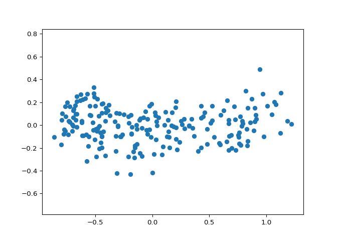
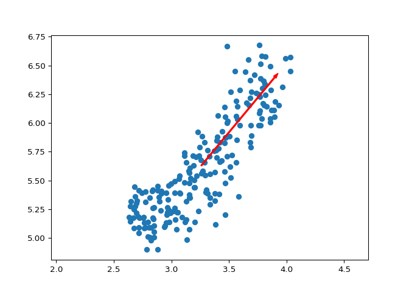
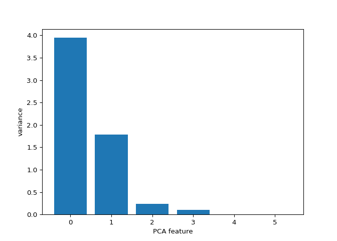

## Decorrelating your data and dimension reduction

<p class="chapter__description">
Dimension reduction summarizes a dataset using its common occuring
patterns. In this chapter, you’ll learn about the most fundamental of
dimension reduction techniques, “Principal Component Analysis” (“PCA”).
PCA is often used before supervised learning to improve model
performance and generalization. It can also be useful for unsupervised
learning. For example, you’ll employ a variant of PCA will allow you to
cluster Wikipedia articles by their content!
</p>

### Visualizing the PCA transformation

#### Correlated data in nature

<p>
You are given an array <code>grains</code> giving the width and length
of samples of grain. You suspect that width and length will be
correlated. To confirm this, make a scatter plot of width vs length and
measure their Pearson correlation.
</p>

<li>
Import:
<li>
<code>matplotlib.pyplot</code> as <code>plt</code>.
</li>
<li>
<code>pearsonr</code> from <code>scipy.stats</code>.
</li>
</li>
<li>
Assign column <code>0</code> of <code>grains</code> to
<code>width</code> and column <code>1</code> of <code>grains</code> to
<code>length</code>.
</li>
<li>
Make a scatter plot with <code>width</code> on the x-axis and
<code>length</code> on the y-axis.
</li>
<li>
Use the <code>pearsonr()</code> function to calculate the Pearson
correlation of <code>width</code> and <code>length</code>.
</li>

``` python
# edited/added
import pandas as pd
import numpy as np
grains = pd.read_csv("archive/Unsupervised-Learning-in-Python/datasets/grains.csv")
grains = np.array(grains)[:,[4,3]]

# Perform the necessary imports
import matplotlib.pyplot as plt
from scipy.stats import pearsonr

# Assign the 0th column of grains: width
width = grains[:,0]

# Assign the 1st column of grains: length
length = grains[:,1]

# Scatter plot width vs length
plt.scatter(width, length)
plt.axis('equal')
```

    ## (2.55985, 4.10315, 4.8102, 6.7638)

``` python
plt.show()

# Calculate the Pearson correlation
```


``` python
correlation, pvalue = pearsonr(width, length)

# Display the correlation
print(correlation)
```

    ## 0.8604149377143467

<p class>
Great work! As you would expect, the width and length of the grain
samples are highly correlated.
</p>

#### Decorrelating the grain measurements with PCA

<p>
You observed in the previous exercise that the width and length
measurements of the grain are correlated. Now, you’ll use PCA to
decorrelate these measurements, then plot the decorrelated points and
measure their Pearson correlation.
</p>

<li>
Import <code>PCA</code> from <code>sklearn.decomposition</code>.
</li>
<li>
Create an instance of <code>PCA</code> called <code>model</code>.
</li>
<li>
Use the <code>.fit_transform()</code> method of <code>model</code> to
apply the PCA transformation to <code>grains</code>. Assign the result
to <code>pca_features</code>.
</li>
<li>
The subsequent code to extract, plot, and compute the Pearson
correlation of the first two columns <code>pca_features</code> has been
written for you, so hit submit to see the result!
</li>

``` python
# Import PCA
from sklearn.decomposition import PCA

# Create PCA instance: model
model = PCA()

# Apply the fit_transform method of model to grains: pca_features
pca_features = model.fit_transform(grains)

# Assign 0th column of pca_features: xs
xs = pca_features[:,0]

# Assign 1st column of pca_features: ys
ys = pca_features[:,1]

# Scatter plot xs vs ys
plt.scatter(xs, ys)
plt.axis('equal')
```

    ## (-0.9666954859113024, 1.3255192221382366, -0.47614840965670485, 0.5348749465462598)

``` python
plt.show()

# Calculate the Pearson correlation of xs and ys
```



``` python
correlation, pvalue = pearsonr(xs, ys)

# Display the correlation
print(correlation)
```

    ## 8.933825901280557e-17

<p class>
Excellent! You’ve successfully decorrelated the grain measurements with
PCA!
</p>

#### Principal components

<p>
On the right are three scatter plots of the same point cloud. Each
scatter plot shows a different set of axes (in red). In which of the
plots could the axes represent the principal components of the point
cloud?
</p>
<p>
Recall that the principal components are the directions along which the
the data varies.
</p>


-   [ ] None of them.
-   [x] Both plot 1 and plot 3.
-   [ ] Plot 2.

<p class>
Well done! You’ve correctly inferred that the principal components have
to align with the axes of the point cloud. This happens in both plot 1
and plot 3.
</p>

### Intrinsic dimension

#### The first principal component

<p>
The first principal component of the data is the direction in which the
data varies the most. In this exercise, your job is to use PCA to find
the first principal component of the length and width measurements of
the grain samples, and represent it as an arrow on the scatter plot.
</p>
<p>
The array <code>grains</code> gives the length and width of the grain
samples. PyPlot (<code>plt</code>) and <code>PCA</code> have already
been imported for you.
</p>

<li>
Make a scatter plot of the grain measurements. This has been done for
you.
</li>
<li>
Create a <code>PCA</code> instance called <code>model</code>.
</li>
<li>
Fit the model to the <code>grains</code> data.
</li>
<li>
Extract the coordinates of the mean of the data using the
<code>.mean\_</code> attribute of <code>model</code>.
</li>
<li>
Get the first principal component of <code>model</code> using the
<code>.components\_\[0,:\]</code> attribute.
</li>
<li>
Plot the first principal component as an arrow on the scatter plot,
using the <code>plt.arrow()</code> function. You have to specify the
first two arguments - <code>mean\[0\]</code> and <code>mean\[1\]</code>.
</li>

``` python
# Make a scatter plot of the untransformed points
plt.scatter(grains[:,0], grains[:,1])

# Create a PCA instance: model
model = PCA()

# Fit model to points
model.fit(grains)

# Get the mean of the grain samples: mean
```

    ## PCA()

``` python
mean = model.mean_

# Get the first principal component: first_pc
first_pc = model.components_[0,:]

# Plot first_pc as an arrow, starting at mean
plt.arrow(mean[0], mean[1], first_pc[0], first_pc[1], color='red', width=0.01)

# Keep axes on same scale
plt.axis('equal')
```

    ## (2.55985, 4.10315, 4.8102, 6.7638)

``` python
plt.show()
```



<p class>
Excellent job! This is the direction in which the grain data varies the
most.
</p>

#### Variance of the PCA features

<p>
The fish dataset is 6-dimensional. But what is its <em>intrinsic</em>
dimension? Make a plot of the variances of the PCA features to find out.
As before, <code>samples</code> is a 2D array, where each row represents
a fish. You’ll need to standardize the features first.
</p>

<li>
Create an instance of <code>StandardScaler</code> called
<code>scaler</code>.
</li>
<li>
Create a <code>PCA</code> instance called <code>pca</code>.
</li>
<li>
Use the <code>make_pipeline()</code> function to create a pipeline
chaining <code>scaler</code> and <code>pca</code>.
</li>
<li>
Use the <code>.fit()</code> method of <code>pipeline</code> to fit it to
the fish samples <code>samples</code>.
</li>
<li>
Extract the number of components used using the
<code>.n_components\_</code> attribute of <code>pca</code>. Place this
inside a <code>range()</code> function and store the result as
<code>features</code>.
</li>
<li>
Use the <code>plt.bar()</code> function to plot the explained variances,
with <code>features</code> on the x-axis and
<code>pca.explained_variance\_</code> on the y-axis.
</li>

``` python
# edited/added
fish = np.array(pd.read_csv("archive/Unsupervised-Learning-in-Python/datasets/fish.csv", header = None))
samples = fish[:,1:]
species = fish[:,0]

# Perform the necessary imports
from sklearn.decomposition import PCA
from sklearn.preprocessing import StandardScaler
from sklearn.pipeline import make_pipeline
import matplotlib.pyplot as plt

# Create scaler: scaler
scaler = StandardScaler()

# Create a PCA instance: pca
pca = PCA()

# Create pipeline: pipeline
pipeline = make_pipeline(scaler, pca)

# Fit the pipeline to 'samples'
pipeline.fit(samples)

# Plot the explained variances
```

    ## Pipeline(steps=[('standardscaler', StandardScaler()), ('pca', PCA())])

``` python
features = range(pca.n_components_)

plt.bar(features, pca.explained_variance_)
```

    ## <BarContainer object of 6 artists>

``` python
plt.xlabel('PCA feature')
plt.ylabel('variance')
plt.xticks(features)
```

    ## ([<matplotlib.axis.XTick object at 0x7ffcd9269cd0>, <matplotlib.axis.XTick object at 0x7ffcd9269f40>, <matplotlib.axis.XTick object at 0x7ffcd5657850>, <matplotlib.axis.XTick object at 0x7ffcd922e610>, <matplotlib.axis.XTick object at 0x7ffcd92137c0>, <matplotlib.axis.XTick object at 0x7ffcdacd1c70>], [Text(0, 0, ''), Text(0, 0, ''), Text(0, 0, ''), Text(0, 0, ''), Text(0, 0, ''), Text(0, 0, '')])

``` python
plt.show()
```



<p class>
Great work! It looks like PCA features 0 and 1 have significant
variance.
</p>

#### Intrinsic dimension of the fish data

<p>
In the previous exercise, you plotted the variance of the PCA features
of the fish measurements. Looking again at your plot, what do you think
would be a reasonable choice for the “intrinsic dimension” of the fish
measurements? Recall that the intrinsic dimension is the number of PCA
features with significant variance.
</p>

-   [ ] 1
-   [x] 2
-   [ ] 5

<p class>
Great job! Since PCA features 0 and 1 have significant variance, the
intrinsic dimension of this dataset appears to be 2.
</p>

### Dimension reduction with PCA

#### Dimension reduction

<p>
In a previous exercise, you saw that <code>2</code> was a reasonable
choice for the “intrinsic dimension” of the fish measurements. Now use
PCA for dimensionality reduction of the fish measurements, retaining
only the 2 most important components.
</p>
<p>
The fish measurements have already been scaled for you, and are
available as <code>scaled_samples</code>.
</p>

<li>
Import <code>PCA</code> from <code>sklearn.decomposition</code>.
</li>
<li>
Create a PCA instance called <code>pca</code> with
<code>n_components=2</code>.
</li>
<li>
Use the <code>.fit()</code> method of <code>pca</code> to fit it to the
scaled fish measurements <code>scaled_samples</code>.
</li>
<li>
Use the <code>.transform()</code> method of <code>pca</code> to
transform the <code>scaled_samples</code>. Assign the result to
<code>pca_features</code>.
</li>

``` python
# edited/added
scaler = StandardScaler()
scaled_samples = scaler.fit_transform(samples)

# Import PCA
from sklearn.decomposition import PCA

# Create a PCA instance with 2 components: pca
pca = PCA(n_components=2)

# Fit the PCA instance to the scaled samples
pca.fit(scaled_samples)

# Transform the scaled samples: pca_features
```

    ## PCA(n_components=2)

``` python
pca_features = pca.transform(scaled_samples)

# Print the shape of pca_features
print(pca_features.shape)
```

    ## (85, 2)

<p class>
Superb! You’ve successfully reduced the dimensionality from 6 to 2.
</p>

#### A tf-idf word-frequency array

<p>
In this exercise, you’ll create a tf-idf word frequency array for a toy
collection of documents. For this, use the <code>TfidfVectorizer</code>
from sklearn. It transforms a list of documents into a word frequency
array, which it outputs as a csr_matrix. It has <code>fit()</code> and
<code>transform()</code> methods like other sklearn objects.
</p>
<p>
You are given a list <code>documents</code> of toy documents about pets.
Its contents have been printed in the IPython Shell.
</p>

<li>
Import <code>TfidfVectorizer</code> from
<code>sklearn.feature_extraction.text</code>.
</li>
<li>
Create a <code>TfidfVectorizer</code> instance called
<code>tfidf</code>.
</li>
<li>
Apply <code>.fit_transform()</code> method of <code>tfidf</code> to
<code>documents</code> and assign the result to <code>csr_mat</code>.
This is a word-frequency array in csr_matrix format.
</li>
<li>
Inspect <code>csr_mat</code> by calling its <code>.toarray()</code>
method and printing the result. This has been done for you.
</li>
<li>
The columns of the array correspond to words. Get the list of words by
calling the <code>.get_feature_names()</code> method of
<code>tfidf</code>, and assign the result to <code>words</code>.
</li>

``` python
# edited/added
documents = ['cats say meow', 'dogs say woof', 'dogs chase cats']

# Import TfidfVectorizer
from sklearn.feature_extraction.text import TfidfVectorizer

# Create a TfidfVectorizer: tfidf
tfidf = TfidfVectorizer() 

# Apply fit_transform to document: csr_mat
csr_mat = tfidf.fit_transform(documents)

# Print result of toarray() method
print(csr_mat.toarray())

# Get the words: words
```

    ## [[0.51785612 0.         0.         0.68091856 0.51785612 0.        ]
    ##  [0.         0.         0.51785612 0.         0.51785612 0.68091856]
    ##  [0.51785612 0.68091856 0.51785612 0.         0.         0.        ]]

``` python
words = tfidf.get_feature_names()

# Print words
print(words)
```

    ## ['cats', 'chase', 'dogs', 'meow', 'say', 'woof']

<p class>
Great work! You’ll now move to clustering Wikipedia articles!
</p>

#### Clustering Wikipedia part I

<p>
You saw in the video that <code>TruncatedSVD</code> is able to perform
PCA on sparse arrays in csr_matrix format, such as word-frequency
arrays. Combine your knowledge of TruncatedSVD and k-means to cluster
some popular pages from Wikipedia. In this exercise, build the pipeline.
In the next exercise, you’ll apply it to the word-frequency array of
some Wikipedia articles.
</p>
<p>
Create a Pipeline object consisting of a TruncatedSVD followed by
KMeans. (This time, we’ve precomputed the word-frequency matrix for you,
so there’s no need for a TfidfVectorizer).
</p>
<p>
The Wikipedia dataset you will be working with was obtained from
<a href="https://blog.lateral.io/2015/06/the-unknown-perils-of-mining-wikipedia/">here</a>.
</p>

<li>
Import:
<li>
<code>TruncatedSVD</code> from <code>sklearn.decomposition</code>.
</li>
<li>
<code>KMeans</code> from <code>sklearn.cluster</code>.
</li>
<li>
<code>make_pipeline</code> from <code>sklearn.pipeline</code>.
</li>
</li>
<li>
Create a <code>TruncatedSVD</code> instance called <code>svd</code> with
<code>n_components=50</code>.
</li>
<li>
Create a <code>KMeans</code> instance called <code>kmeans</code> with
<code>n_clusters=6</code>.
</li>
<li>
Create a pipeline called <code>pipeline</code> consisting of
<code>svd</code> and <code>kmeans</code>.
</li>

``` python
# Perform the necessary imports
from sklearn.decomposition import TruncatedSVD
from sklearn.cluster import KMeans
from sklearn.pipeline import make_pipeline

# Create a TruncatedSVD instance: svd
svd = TruncatedSVD(n_components=50)

# Create a KMeans instance: kmeans
kmeans = KMeans(n_clusters=6)

# Create a pipeline: pipeline
pipeline = make_pipeline(svd, kmeans)
```

<p class>
Excellent! Now that you have set up your pipeline, you will use it in
the next exercise to cluster the articles.
</p>

#### Clustering Wikipedia part II

<p>
It is now time to put your pipeline from the previous exercise to work!
You are given an array <code>articles</code> of tf-idf word-frequencies
of some popular Wikipedia articles, and a list <code>titles</code> of
their titles. Use your pipeline to cluster the Wikipedia articles.
</p>
<p>
A solution to the previous exercise has been pre-loaded for you, so a
Pipeline <code>pipeline</code> chaining TruncatedSVD with KMeans is
available.
</p>

<li>
Import <code>pandas</code> as <code>pd</code>.
</li>
<li>
Fit the pipeline to the word-frequency array <code>articles</code>.
</li>
<li>
Predict the cluster labels.
</li>
<li>
Align the cluster labels with the list <code>titles</code> of article
titles by creating a DataFrame <code>df</code> with <code>labels</code>
and <code>titles</code> as columns. This has been done for you.
</li>
<li>
Use the <code>.sort_values()</code> method of <code>df</code> to sort
the DataFrame by the <code>‘label’</code> column, and print the result.
</li>
<li>
Hit submit and take a moment to investigate your amazing clustering of
Wikipedia pages!
</li>

``` python
# edited/added
from scipy.sparse import csc_matrix
documents = pd.read_csv('archive/Unsupervised-Learning-in-Python/datasets/wikipedia-vectors.csv', index_col=0)
titles = documents.columns
articles = csc_matrix(documents.values).T

# Import pandas
import pandas as pd

# Fit the pipeline to articles
pipeline.fit(articles)

# Calculate the cluster labels: labels
```

    ## Pipeline(steps=[('truncatedsvd', TruncatedSVD(n_components=50)),
    ##                 ('kmeans', KMeans(n_clusters=6))])

``` python
labels = pipeline.predict(articles)

# Create a DataFrame aligning labels and titles: df
df = pd.DataFrame({'label': labels, 'article': titles})

# Display df sorted by cluster label
print(df.sort_values('label'))
```

    ##     label                                        article
    ## 19      0  2007 United Nations Climate Change Conference
    ## 18      0  2010 United Nations Climate Change Conference
    ## 17      0  Greenhouse gas emissions by the United States
    ## 16      0                                        350.org
    ## 15      0                                 Kyoto Protocol
    ## 14      0                                 Climate change
    ## 13      0                               Connie Hedegaard
    ## 12      0                                   Nigel Lawson
    ## 11      0       Nationally Appropriate Mitigation Action
    ## 10      0                                 Global warming
    ## 58      1                                         Sepsis
    ## 59      1                                    Adam Levine
    ## 50      1                                   Chad Kroeger
    ## 51      1                                     Nate Ruess
    ## 52      1                                     The Wanted
    ## 53      1                                   Stevie Nicks
    ## 54      1                                 Arctic Monkeys
    ## 55      1                                  Black Sabbath
    ## 56      1                                       Skrillex
    ## 57      1                          Red Hot Chili Peppers
    ## 40      2                                    Tonsillitis
    ## 41      2                                    Hepatitis B
    ## 42      2                                    Doxycycline
    ## 49      2                                       Lymphoma
    ## 43      2                                       Leukemia
    ## 45      2                                    Hepatitis C
    ## 46      2                                     Prednisone
    ## 47      2                                          Fever
    ## 48      2                                     Gabapentin
    ## 44      2                                           Gout
    ## 38      3                                         Neymar
    ## 30      3                  France national football team
    ## 31      3                              Cristiano Ronaldo
    ## 32      3                                   Arsenal F.C.
    ## 33      3                                 Radamel Falcao
    ## 34      3                             Zlatan Ibrahimović
    ## 35      3                Colombia national football team
    ## 36      3              2014 FIFA World Cup qualification
    ## 37      3                                       Football
    ## 39      3                                  Franck Ribéry
    ## 29      4                               Jennifer Aniston
    ## 27      4                                 Dakota Fanning
    ## 26      4                                     Mila Kunis
    ## 25      4                                  Russell Crowe
    ## 24      4                                   Jessica Biel
    ## 23      4                           Catherine Zeta-Jones
    ## 22      4                              Denzel Washington
    ## 21      4                             Michael Fassbender
    ## 20      4                                 Angelina Jolie
    ## 28      4                                  Anne Hathaway
    ## 1       5                                 Alexa Internet
    ## 2       5                              Internet Explorer
    ## 3       5                                    HTTP cookie
    ## 4       5                                  Google Search
    ## 8       5                                        Firefox
    ## 6       5                    Hypertext Transfer Protocol
    ## 7       5                                  Social search
    ## 9       5                                       LinkedIn
    ## 5       5                                         Tumblr
    ## 0       5                                       HTTP 404

<p class>
Fantastic! Take a look at the cluster labels and see if you can identify
any patterns!
</p>